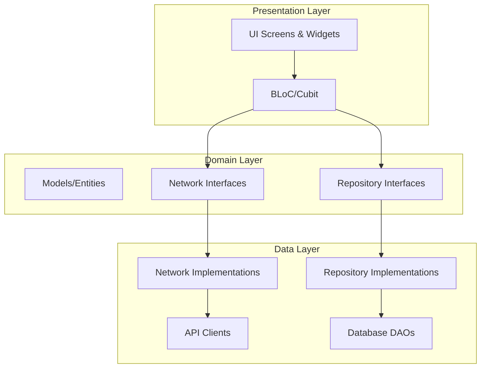

# Flutter Clean Architecture Starter - Project Documentation

## 📋 Table of Contents

1. [Project Overview](#project-overview)
2. [Architecture](#architecture)
3. [Project Structure](#project-structure)
4. [Asset Management with flutter_gen](#asset-management-with-flutter_gen)
5. [How to Integrate New APIs](#how-to-integrate-new-apis)
6. [State Management](#state-management)
7. [Routing](#routing)
8. [Database](#database)
9. [Development Workflow](#development-workflow)
10. [Best Practices](#best-practices)

---

## 🎯 Project Overview

This is a **Clean Architecture Flutter Starter** project designed for scalable, maintainable, and testable mobile applications. The project follows industry best practices with a modular architecture using local packages.

### Key Features

- ✅ **Clean Architecture** with clear separation of concerns
- ✅ **Modular Package Structure** for better code organization
- ✅ **Type-Safe Asset Management** with flutter_gen
- ✅ **BLoC/Cubit** for state management
- ✅ **Go Router** for declarative navigation
- ✅ **Isar Database** for local data persistence
- ✅ **Dio HTTP Client** with custom JSON client wrapper
- ✅ **Dependency Injection** using get_it and injectable
- ✅ **Internationalization** support (i18n/l10n)

---

## 🏗️ Architecture

This project implements **Clean Architecture** with three distinct layers:



### Layer Responsibilities

#### 1. **Presentation Layer** (`lib/src/ui/`)
- **Screens**: UI components and pages
- **Widgets**: Reusable UI components
- **BLoCs/Cubits**: State management logic

#### 2. **Domain Layer** (`packages/core_sdk/lib/domain/`)
- **Models**: Data entities and DTOs
- **Repository Interfaces**: Abstract contracts for data access
- **Network Interfaces**: Abstract contracts for API calls

#### 3. **Data Layer** (`packages/core_sdk_impl/lib/src/`)
- **Repository Implementations**: Concrete implementations of repository interfaces
- **Network Implementations**: Concrete implementations of network interfaces
- **APIs**: HTTP client configurations and API endpoints
- **DAOs**: Database access objects for Isar

---

## 📁 Project Structure

```
flutter-starter/
├── lib/
│   ├── src/
│   │   ├── assets/          # Asset reference classes (replaced by flutter_gen)
│   │   ├── blocs/           # BLoC/Cubit state management
│   │   ├── data/            # App-level data (Prefs, etc.)
│   │   ├── enums/           # Enumerations
│   │   ├── extensions/      # Dart extensions
│   │   ├── models/          # App-level models
│   │   ├── routes/          # Go Router configuration
│   │   ├── theme/           # Theme definitions
│   │   ├── ui/              # UI screens and widgets
│   │   └── utils/           # Utility functions
│   ├── l10n/                # Localization files
│   ├── gen/                 # Generated code (flutter_gen assets)
│   ├── application.dart     # Main app widget
│   └── bootstrap.dart       # App initialization
│
├── packages/
│   ├── common_sdk/          # Common utilities and DI
│   ├── core_sdk/            # Domain layer (interfaces, models)
│   ├── core_sdk_impl/       # Data layer (implementations)
│   ├── isar_e2m/            # Isar database wrapper
│   └── json_client/         # Dio HTTP client wrapper
│
├── assets/
│   ├── fonts/               # Font files
│   ├── images/              # Image assets (PNG, JPG)
│   ├── svgs/                # SVG assets
│   └── others/              # Other assets
│
├── android/                 # Android platform code
├── ios/                     # iOS platform code
├── linux/                   # Linux platform code
├── macos/                   # macOS platform code
├── windows/                 # Windows platform code
└── web/                     # Web platform code
```

### Local Packages Overview

| Package | Purpose |
|---------|---------|
| **common_sdk** | Common utilities, dependency injection setup (get_it) |
| **core_sdk** | Domain layer - interfaces, models, entities |
| **core_sdk_impl** | Data layer - implementations of repositories and networks |
| **isar_e2m** | Wrapper around Isar database for easy-to-use persistence |
| **json_client** | Wrapper around Dio for HTTP requests with custom configurations |

---

## 🎨 Asset Management with flutter_gen

### Overview

This project uses **flutter_gen** for type-safe, auto-generated asset references. This eliminates manual string paths and provides compile-time safety.

### Configuration

In [pubspec.yaml](file:///e:/flutter-starter%20-%20working/pubspec.yaml):

```yaml
dev_dependencies:
  flutter_gen: ^5.12.0

flutter_gen:
  output: lib/gen/
  line_length: 80
  
  integrations:
    flutter_svg: true
    
flutter:
  assets:
    - assets/images/
    - assets/svgs/
  
  fonts:
    - family: inter
      fonts:
        - asset: assets/fonts/inter.ttf
```

### Usage

#### Before (Manual):
```dart
import 'package:clean_starter/src/assets/images/image_assets.dart';
import 'package:clean_starter/src/assets/svgs/svg_assets.dart';

// Using manual string paths
Image.asset(ImageAssets.logo);
SvgPicture.asset(SvgAssets.user);
```

#### After (flutter_gen):
```dart
import 'package:clean_starter/gen/assets.gen.dart';

// Type-safe, auto-completed asset references
Image.asset(Assets.images.logo.path);
SvgPicture.asset(Assets.svgs.user.path);

// Or use the convenience methods
Assets.images.logo.image();
Assets.svgs.user.svg();
```

### Generating Assets

After adding new assets to the `assets/` directory:

```bash
# Generate asset references
dart run build_runner build --delete-conflicting-outputs

# Or watch for changes
dart run build_runner watch
```

### Available Assets

**Images** (`Assets.images.*`):
- `logo` - App logo (PNG)
- `empty` - Empty state placeholder (PNG)

**SVGs** (`Assets.svgs.*`):
- `user`, `lock`, `hide`, `show` - Form icons
- `check`, `unCheck` - Checkbox icons
- `home`, `profile` - Navigation icons
- `bell` - Notification icon
- `appbarBack`, `appbarSearch` - App bar icons
- `error`, `noData` - State icons
- `logo` - Logo SVG version

**Fonts** (`Assets.fonts.*`):
- `inter` - Inter font family

---

## 🔌 How to Integrate New APIs

This section provides a comprehensive guide for adding new API endpoints to the project.

### Step-by-Step Guide

#### 1. Define the Domain Model

**Location**: `packages/core_sdk/lib/domain/models/`

Create request and response models for your API.

**Example**: Creating a User Profile API

```dart
// packages/core_sdk/lib/domain/models/user/user_model.dart
import 'package:freezed_annotation/freezed_annotation.dart';

part 'user_model.freezed.dart';
part 'user_model.g.dart';

@freezed
class UserModel with _$UserModel {
  const factory UserModel({
    required String id,
    required String name,
    required String email,
    String? avatar,
  }) = _UserModel;

  factory UserModel.fromJson(Map<String, dynamic> json) =>
      _$UserModelFromJson(json);
}
```

**Export the model**:
```dart
// packages/core_sdk/lib/domain/models/user/models.dart
export 'user_model.dart';
```

#### 2. Define the Network Interface

**Location**: `packages/core_sdk/lib/domain/networks/`

Create an abstract interface for the API operations.

```dart
// packages/core_sdk/lib/domain/networks/user_network.dart
import 'package:common_sdk/common_sdk.dart';
import 'package:core_sdk/domain/domain.dart';

abstract class UserNetwork {
  Future<Either<FailureModel, UserModel>> getProfile(String userId);
  Future<Either<FailureModel, UserModel>> updateProfile(UserModel user);
}
```

**Export the network**:
```dart
// packages/core_sdk/lib/domain/networks/networks.dart
export 'user_network.dart';
```

#### 3. Create the API Client

**Location**: `packages/core_sdk_impl/lib/src/apis/`

Create the API client with request/response DTOs.

```dart
// packages/core_sdk_impl/lib/src/apis/user/get_profile_api.dart
import 'package:common_sdk/common_sdk.dart';
import 'package:core_sdk/core_sdk.dart';
import 'package:core_sdk_impl/src/apis/api_endpoints.dart';
import 'package:core_sdk_impl/src/apis/base/base_object_api.dart';
import 'package:json_annotation/json_annotation.dart';
import 'package:json_client/json_client.dart';

part 'get_profile_api.g.dart';
part 'get_profile_request.dart';
part 'get_profile_response.dart';

@singleton
class GetProfileApi extends BaseJsonObjectApi<GetProfileRequest, GetProfileResponse> {
  GetProfileApi()
      : super(
          path: ApiEndpoints.userProfile,
          method: ApiMethod.get,
          refreshToken: true,
        );

  Future<Either<FailureModel, UserModel>> call(String userId) async {
    final request = GetProfileRequest(userId: userId);
    try {
      final response = await apiCall(req: request);
      return response.fold(
        (failure) {
          Logger.shared.log('GetProfileAPI (FAILURE): ${failure.toModel()}');
          return Left(failure.toModel());
        },
        (response) {
          Logger.shared.log('GetProfileAPI (SUCCESS): ${response.toModel()}');
          return Right(response.toModel());
        },
      );
    } catch (e) {
      Logger.shared.log('GetProfileAPI (FAILURE+): $e');
      return Left(FailureModel.generic());
    }
  }

  @override
  GetProfileResponse convertResponse(Map<String, dynamic> json) {
    return GetProfileResponse.fromJson(json);
  }
}
```

**Request DTO**:
```dart
// Part of get_profile_api.dart
part 'get_profile_request.dart';

@JsonSerializable()
class GetProfileRequest {
  final String userId;

  GetProfileRequest({required this.userId});

  Map<String, dynamic> toJson() => _$GetProfileRequestToJson(this);
}
```

**Response DTO**:
```dart
// Part of get_profile_api.dart
part 'get_profile_response.dart';

@JsonSerializable()
class GetProfileResponse {
  final String id;
  final String name;
  final String email;
  final String? avatar;

  GetProfileResponse({
    required this.id,
    required this.name,
    required this.email,
    this.avatar,
  });

  factory GetProfileResponse.fromJson(Map<String, dynamic> json) =>
      _$GetProfileResponseFromJson(json);

  UserModel toModel() => UserModel(
        id: id,
        name: name,
        email: email,
        avatar: avatar,
      );
}
```

#### 4. Add API Endpoint

**Location**: `packages/core_sdk_impl/lib/src/apis/api_endpoints.dart`

```dart
abstract class ApiEndpoints {
  static const String login = '/auth/login';
  static const String userProfile = '/user/profile'; // Add this
}
```

#### 5. Implement the Network Interface

**Location**: `packages/core_sdk_impl/lib/src/networks/`

```dart
// packages/core_sdk_impl/lib/src/networks/user_network_impl.dart
import 'package:common_sdk/common_sdk.dart';
import 'package:core_sdk/domain/domain.dart';
import 'package:core_sdk_impl/src/apis/user/get_profile_api.dart';
import 'package:core_sdk_impl/src/data_get_it.dart';
import 'package:injectable/injectable.dart';

@Singleton(as: UserNetwork)
class UserNetworkImpl implements UserNetwork {
  @override
  Future<Either<FailureModel, UserModel>> getProfile(String userId) =>
      DataGetIt.shared.get<GetProfileApi>().call(userId);

  @override
  Future<Either<FailureModel, UserModel>> updateProfile(UserModel user) {
    // Implement update logic
    throw UnimplementedError();
  }
}
```

#### 6. Create Repository Interface (Optional)

**Location**: `packages/core_sdk/lib/domain/repositories/`

If you need local caching with Isar:

```dart
// packages/core_sdk/lib/domain/repositories/user_repository.dart
import 'package:core_sdk/domain/domain.dart';
import 'package:core_sdk/domain/repositories/base_repository.dart';

abstract class UserRepository extends BaseRepository<UserModel> {
  Future<UserModel?> getCurrentUser();
}
```

#### 7. Implement Repository (Optional)

**Location**: `packages/core_sdk_impl/lib/src/repositories/`

```dart
// packages/core_sdk_impl/lib/src/repositories/user_repository_impl.dart
import 'package:core_sdk/domain/domain.dart';
import 'package:core_sdk_impl/src/data_get_it.dart';
import 'package:core_sdk_impl/src/database/daos/user_dao.dart';
import 'package:core_sdk_impl/src/repositories/base_repository_impl.dart';
import 'package:injectable/injectable.dart';

@Singleton(as: UserRepository)
class UserRepositoryImpl extends BaseRepositoryImpl<UserModel>
    implements UserRepository {
  @override
  UserDao getDao() => DataGetIt.shared.get<UserDao>();

  @override
  Future<UserModel?> getCurrentUser() async {
    final users = await getDao().getAll();
    return users.isNotEmpty ? users.first : null;
  }
}
```

#### 8. Generate Code

Run code generation for freezed, json_serializable, and injectable:

```bash
# In the main project
cd e:\flutter-starter - working
flutter pub get
dart run build_runner build --delete-conflicting-outputs

# In core_sdk package
cd packages/core_sdk
flutter pub get
dart run build_runner build --delete-conflicting-outputs

# In core_sdk_impl package
cd ../core_sdk_impl
flutter pub get
dart run build_runner build --delete-conflicting-outputs
```

#### 9. Use in BLoC/Cubit

**Location**: `lib/src/blocs/`

```dart
// lib/src/blocs/user/user_cubit.dart
import 'package:common_sdk/common_sdk.dart';
import 'package:core_sdk/core_sdk.dart';
import 'package:core_sdk_impl/core_sdk_impl.dart';
import 'package:flutter_bloc/flutter_bloc.dart';

class UserCubit extends Cubit<UserModel?> {
  UserCubit() : super(null);

  final _networks = CoreSdkImpl.shared.getNetworks();

  Future<void> loadProfile(String userId) async {
    final result = await _networks.userNetwork.getProfile(userId);
    result.fold(
      (failure) {
        Logger.shared.log('Failed to load profile: ${failure.message}');
        SnackBarHelper.showError(failure.message);
      },
      (user) {
        emit(user);
      },
    );
  }
}
```

### API Integration Checklist

- [ ] Define domain models in `core_sdk/lib/domain/models/`
- [ ] Create network interface in `core_sdk/lib/domain/networks/`
- [ ] Implement API client in `core_sdk_impl/lib/src/apis/`
- [ ] Add endpoint to `api_endpoints.dart`
- [ ] Implement network interface in `core_sdk_impl/lib/src/networks/`
- [ ] (Optional) Create repository interface in `core_sdk/lib/domain/repositories/`
- [ ] (Optional) Implement repository in `core_sdk_impl/lib/src/repositories/`
- [ ] Run code generation with `build_runner`
- [ ] Use in BLoC/Cubit for state management
- [ ] Test the integration

---

## 🎭 State Management

This project uses **BLoC pattern** with **Cubit** for state management.

### BLoC Structure

```
lib/src/blocs/
├── app_language/        # App language selection
├── auth/                # Authentication state
├── device_status/       # Network connectivity
├── profile/             # User profile
└── [feature]/           # Feature-specific state
```

### Creating a New Cubit

```dart
// lib/src/blocs/counter/counter_cubit.dart
import 'package:flutter_bloc/flutter_bloc.dart';

class CounterCubit extends Cubit<int> {
  CounterCubit() : super(0);

  void increment() => emit(state + 1);
  void decrement() => emit(state - 1);
}
```

### Using Cubit in UI

```dart
// Provide the cubit
BlocProvider(
  create: (_) => CounterCubit(),
  child: CounterScreen(),
)

// Listen to state changes
BlocBuilder<CounterCubit, int>(
  builder: (context, count) {
    return Text('Count: $count');
  },
)

// Access cubit methods
context.read<CounterCubit>().increment();
```

---

## 🧭 Routing

This project uses **go_router** for declarative, type-safe routing.

### Route Structure

```
lib/src/routes/
├── auth/
│   └── auth_route.dart      # Authentication routes
├── dashboard/
│   └── dashboard_route.dart # Dashboard routes
├── home/
│   └── home_route.dart      # Home routes
└── routes.dart              # Main router configuration
```

### Adding a New Route

**1. Define route path**:

```dart
// lib/src/routes/settings/settings_route.dart
import 'package:go_router/go_router.dart';
import 'package:clean_starter/src/ui/screens/settings/settings_screen.dart';

class SettingsRoute {
  static const String settings = '/settings';

  static List<GoRoute> routes = [
    GoRoute(
      path: settings,
      builder: (context, state) => const SettingsScreen(),
    ),
  ];
}
```

**2. Register in main router**:

```dart
// lib/src/routes/routes.dart
import 'settings/settings_route.dart';

class Routes {
  static GoRouter create(AuthCubit authCubit) {
    return GoRouter(
      routes: [
        ...AuthRoutes.routes,
        DashboardRoute.route,
        ...HomeRoutes.routes,
        ...SettingsRoute.routes, // Add this
      ],
    );
  }
}
```

**3. Navigate to route**:

```dart
// Push navigation
context.push(SettingsRoute.settings);

// Replace navigation
context.go(SettingsRoute.settings);

// Pop navigation
context.pop();
```

---

## 💾 Database

This project uses **Isar** database through the `isar_e2m` wrapper package.

### Database Structure

```
packages/core_sdk_impl/lib/src/database/
├── daos/                # Data Access Objects
│   ├── login_dao.dart
│   └── [entity]_dao.dart
├── entities/            # Isar entities
│   ├── login_entity.dart
│   └── [entity]_entity.dart
└── database.dart        # Database initialization
```

### Creating a New Entity

**1. Define Isar entity**:

```dart
// packages/core_sdk_impl/lib/src/database/entities/user_entity.dart
import 'package:isar/isar.dart';

part 'user_entity.g.dart';

@collection
class UserEntity {
  Id id = Isar.autoIncrement;
  
  late String userId;
  late String name;
  late String email;
  String? avatar;
}
```

**2. Create DAO**:

```dart
// packages/core_sdk_impl/lib/src/database/daos/user_dao.dart
import 'package:isar_e2m/isar_e2m.dart';
import 'package:core_sdk_impl/src/database/entities/user_entity.dart';
import 'package:injectable/injectable.dart';

@singleton
class UserDao extends BaseDao<UserEntity> {
  Future<UserEntity?> findByUserId(String userId) async {
    return await isar.userEntitys
        .filter()
        .userIdEqualTo(userId)
        .findFirst();
  }
}
```

**3. Register in database**:

```dart
// packages/core_sdk_impl/lib/src/database/database.dart
static Future<void> initialize() async {
  await IsarE2M.initialize(
    schemas: [
      LoginEntitySchema,
      UserEntitySchema, // Add this
    ],
  );
}
```

**4. Generate code**:

```bash
cd packages/core_sdk_impl
dart run build_runner build --delete-conflicting-outputs
```

---

## 📝 Example: Adding a Create Note Feature

This section provides a complete, step-by-step guide for adding a new feature with local database storage, using the **Create Note** feature as a real example.

### Overview

We'll create a feature that allows users to create notes stored in the local Isar database, accessible via a floating action button (FAB) in the bottom navigation bar.

### Folder & File Structure

```
📁 Project Root
├── 📁 packages/
│   ├── 📁 core_sdk/                          # Domain Layer
│   │   └── 📁 lib/domain/models/
│   │       └── 📁 note/                       # ✨ NEW: Note domain models
│   │           ├── models.dart                # Barrel file with imports
│   │           └── note_model.dart            # Freezed model definition
│   │
│   └── 📁 core_sdk_impl/                      # Data Layer
│       └── 📁 lib/src/
│           └── 📁 database/
│               ├── 📁 entities/
│               │   ├── entities.dart          # ✏️ MODIFIED: Added note_entity part
│               │   └── note_entity.dart       # ✨ NEW: Isar entity
│               ├── 📁 daos/
│               │   ├── note_dao.dart          # ✨ NEW: DAO interface
│               │   └── 📁 impl/
│               │       └── note_dao_impl.dart # ✨ NEW: DAO implementation
│               └── database.dart              # ✏️ MODIFIED: Registered NoteEntitySchema
│
└── 📁 lib/src/
    ├── 📁 blocs/
    │   └── 📁 note/                           # ✨ NEW: Note state management
    │       └── create_note_cubit.dart         # Cubit for create operation
    │
    └── 📁 ui/
        ├── 📁 screens/dashboard/components/
        │   └── custom_bottom_navigation_bar.dart  # ✏️ MODIFIED: Added FAB
        │
        └── 📁 widgets/custom_bottom_modal_sheet/
            └── create_note_bottom_sheet.dart      # ✨ NEW: Bottom sheet UI
```

### Step-by-Step Implementation

#### Step 1: Create Domain Model

**Location**: `packages/core_sdk/lib/domain/models/note/`

Create the freezed model for immutability and JSON serialization:

**`note_model.dart`**:
```dart
part of 'models.dart';

@freezed
sealed class NoteModel with _$NoteModel {
  const factory NoteModel({
    required String id,
    required String title,
    required String content,
    @JsonKey(
      fromJson: DateTimeConverter.fromJson,
      toJson: DateTimeConverter.toJson,
    )
    required DateTime createdAt,
    @JsonKey(
      fromJson: DateTimeConverter.fromJson,
      toJson: DateTimeConverter.toJson,
    )
    required DateTime updatedAt,
  }) = _NoteModel;

  factory NoteModel.fromJson(Map<String, dynamic> json) =>
      _$NoteModelFromJson(json);

  factory NoteModel.create({
    required String title,
    required String content,
  }) =>
      NoteModel(
        id: DateTime.now().millisecondsSinceEpoch.toString(),
        title: title,
        content: content,
        createdAt: DateTime.now(),
        updatedAt: DateTime.now(),
      );
}
```

**`models.dart`** (barrel file):
```dart
import 'package:core_sdk/domain/utills/date_time_converter.dart';
import 'package:freezed_annotation/freezed_annotation.dart';

part 'models.g.dart';
part 'models.freezed.dart';
part 'note_model.dart';
```

**Export in main models.dart**:
```dart
// packages/core_sdk/lib/domain/models/models.dart
export 'note/models.dart';
```

#### Step 2: Create Isar Entity

**Location**: `packages/core_sdk_impl/lib/src/database/entities/`

**`note_entity.dart`**:
```dart
part of 'entities.dart';

@Collection(accessor: 'notes')
class NoteEntity extends BaseNoSqlEntity {
  @Index(unique: true)
  String id = '';
  String title = '';
  String content = '';
  DateTime createdAt = DateTime.now();
  DateTime updatedAt = DateTime.now();

  NoteEntity();

  factory NoteEntity.fromModel(NoteModel model) {
    final entity = NoteEntity();
    entity.id = model.id;
    entity.title = model.title;
    entity.content = model.content;
    entity.createdAt = model.createdAt;
    entity.updatedAt = model.updatedAt;
    return entity;
  }

  NoteModel toModel() {
    return NoteModel(
      id: id,
      title: title,
      content: content,
      createdAt: createdAt,
      updatedAt: updatedAt,
    );
  }
}
```

**Register in `entities.dart`**:
```dart
part 'note_entity.dart';  // Add this line
```

**Register in `database.dart`**:
```dart
db = await Isar.open(
  [LoginEntitySchema, NoteEntitySchema, ProfileEntitySchema],  // Add NoteEntitySchema
  name: "core_sdk_impl",
  directory: dir.path,
);
```

#### Step 3: Create DAO (Data Access Object)

**Location**: `packages/core_sdk_impl/lib/src/database/daos/`

**`note_dao.dart`** (interface):
```dart
import 'package:common_sdk/common_sdk.dart';
import 'package:core_sdk/domain/domain.dart';
import 'package:isar_e2m/isar_m2e.dart';

abstract class NoteDao extends BaseNoSqlDao<NoteModel, String> {
  Future<List<NoteModel>> getAllNotes();
  Future<void> createNote(NoteModel note);
  Future<void> updateNote(NoteModel note);
  Future<void> deleteNote(String id);
}
```

**`impl/note_dao_impl.dart`** (implementation):
```dart
import 'package:common_sdk/common_sdk.dart';
import 'package:core_sdk/domain/models/note/models.dart';
import 'package:core_sdk_impl/src/database/daos/note_dao.dart';
import 'package:core_sdk_impl/src/database/database.dart';
import 'package:core_sdk_impl/src/database/entities/entities.dart';
import 'package:injectable/injectable.dart';
import 'package:isar_community/isar.dart';
import 'package:isar_e2m/isar_m2e.dart';

@Singleton(as: NoteDao)
class NoteDaoImpl extends BaseNoSqlDaoImpl<NoteModel, NoteEntity, String>
    implements NoteDao {
  NoteDaoImpl();

  @override
  IsarCollection<NoteEntity> get entityCollection => Database.shared.db.notes;

  @override
  Optional<NoteEntity> convertToEntity(NoteModel? model) {
    if (model == null) return Optional.empty();
    return Optional.ofNullable(NoteEntity.fromModel(model));
  }

  @override
  Optional<NoteModel> convertToModel(NoteEntity? entity) =>
      Optional.ofNullable(entity?.toModel());

  @override
  QueryBuilder<NoteEntity, NoteEntity, QAfterWhereClause> idEqual(
    QueryBuilder<NoteEntity, NoteEntity, QWhereClause> queryBuilder,
    String value,
  ) => queryBuilder.idEqualTo(value);

  @override
  String idFromModel(NoteModel model) => model.id;

  @override
  Future<List<NoteModel>> getAllNotes() async => await getAll();

  @override
  Future<void> createNote(NoteModel note) async => await upsert(note);

  @override
  Future<void> updateNote(NoteModel note) async => await upsert(note);

  @override
  Future<void> deleteNote(String id) async => await delete(id);
}
```

#### Step 4: Create State Management (Cubit)

**Location**: `lib/src/blocs/note/`

**`create_note_cubit.dart`**:
```dart
import 'package:common_sdk/common_sdk.dart';
import 'package:core_sdk/domain/models/note/models.dart';
import 'package:core_sdk_impl/src/data_get_it.dart';
import 'package:core_sdk_impl/src/database/daos/note_dao.dart';
import 'package:flutter_bloc/flutter_bloc.dart';

class CreateNoteCubit extends Cubit<NoteModel?> {
  CreateNoteCubit() : super(null);

  final _noteDao = DataGetIt.shared.get<NoteDao>();

  Future<void> createNote({
    required String title,
    required String content,
  }) async {
    try {
      final note = NoteModel.create(
        title: title,
        content: content,
      );
      await _noteDao.createNote(note);
      emit(note);
      Logger.shared.log('Note created: ${note.id}');
    } catch (e) {
      Logger.shared.log('Failed to create note: $e');
      emit(null);
    }
  }

  void reset() => emit(null);
}
```

#### Step 5: Create UI (Bottom Sheet)

**Location**: `lib/src/ui/widgets/custom_bottom_modal_sheet/`

**`create_note_bottom_sheet.dart`**:
```dart
import 'package:clean_starter/src/blocs/note/create_note_cubit.dart';
import 'package:clean_starter/src/ui/default_imports.dart';
import 'package:core_sdk/domain/models/note/models.dart';
import 'package:flutter_bloc/flutter_bloc.dart';

class CreateNoteBottomSheet extends StatefulWidget {
  const CreateNoteBottomSheet({super.key});

  @override
  State<CreateNoteBottomSheet> createState() => _CreateNoteBottomSheetState();
}

class _CreateNoteBottomSheetState extends State<CreateNoteBottomSheet> {
  final _titleController = TextEditingController();
  final _contentController = TextEditingController();
  final _formKey = GlobalKey<FormState>();

  @override
  void dispose() {
    _titleController.dispose();
    _contentController.dispose();
    super.dispose();
  }

  @override
  Widget build(BuildContext context) {
    return BlocProvider(
      create: (_) => CreateNoteCubit(),
      child: Builder(
        builder: (context) {
          return BlocListener<CreateNoteCubit, NoteModel?>(
            listener: (context, state) {
              if (state != null) {
                Navigator.of(context).pop();
                ScaffoldMessenger.of(context).showSnackBar(
                  SnackBar(
                    content: Text('Note created successfully!'),
                    backgroundColor: Colors.green,
                  ),
                );
              }
            },
            child: Container(
              padding: EdgeInsets.only(
                left: 16.w,
                right: 16.w,
                top: 16.w,
                bottom: MediaQuery.of(context).viewInsets.bottom + 16.w,
              ),
              decoration: BoxDecoration(
                color: context.appColorScheme.fillMain,
                borderRadius: BorderRadius.only(
                  topLeft: Radius.circular(16.r),
                  topRight: Radius.circular(16.r),
                ),
              ),
              child: Form(
                key: _formKey,
                child: Column(
                  mainAxisSize: MainAxisSize.min,
                  children: [
                    // Title input, content input, create button
                    // ... (see full implementation in the file)
                  ],
                ),
              ),
            ),
          );
        },
      ),
    );
  }
}
```

#### Step 6: Add FAB to Bottom Navigation

**Location**: `lib/src/ui/screens/dashboard/components/custom_bottom_navigation_bar.dart`

Add imports:
```dart
import 'package:clean_starter/src/ui/widgets/custom_bottom_modal_sheet/create_note_bottom_sheet.dart';
import 'package:clean_starter/src/ui/widgets/custom_bottom_modal_sheet/custom_bottom_modal_sheet.dart';
```

Add FAB between navigation items:
```dart
Row(
  children: [
    Expanded(child: BottomNavItem(...)), // Home
    
    // Create Icon Button (FAB)
    Padding(
      padding: EdgeInsets.symmetric(horizontal: 8.w),
      child: GestureDetector(
        onTap: () {
          CustomBottomModalSheet.open(
            context,
            const CreateNoteBottomSheet(),
          );
        },
        child: Container(
          width: 56.w,
          height: 56.w,
          decoration: BoxDecoration(
            color: context.appColorScheme.brandPrimary,
            shape: BoxShape.circle,
            boxShadow: [
              BoxShadow(
                color: context.appColorScheme.brandPrimary.withValues(alpha: 0.3),
                blurRadius: 8,
                offset: const Offset(0, 4),
              ),
            ],
          ),
          child: Icon(Icons.add, color: context.appColorScheme.baseWhite, size: 28.w),
        ),
      ),
    ),
    
    Expanded(child: BottomNavItem(...)), // Profile
  ],
)
```

#### Step 7: Run Code Generation

```bash
# Generate domain models
cd packages/core_sdk
flutter pub get
dart run build_runner build --delete-conflicting-outputs

# Generate entities and DAOs
cd ../core_sdk_impl
flutter pub get
dart run build_runner build --delete-conflicting-outputs

# Get dependencies for main app
cd ../..
flutter pub get
```

### Key Concepts Explained

#### 1. **Clean Architecture Layers**
- **Domain** (`core_sdk`): Business logic and models - no dependencies on UI or database
- **Data** (`core_sdk_impl`): Database entities, DAOs, API implementations
- **Presentation** (`lib/src`): UI, state management (Cubits), screens

#### 2. **Dependency Injection**
- `@Singleton(as: NoteDao)` - Registers `NoteDaoImpl` as singleton
- `DataGetIt.shared.get<NoteDao>()` - Retrieves the registered instance
- Automatically configured by `injectable` package

#### 3. **Isar Database**
- `@Collection` - Marks class as Isar collection
- `@Index(unique: true)` - Creates unique index on field
- `BaseNoSqlEntity` - Provides `tempId` and `updatedDateTime`
- Code generation creates `NoteEntitySchema`

#### 4. **BLoC Provider Context**
- Use `Builder` widget to get correct context
- `BlocProvider` creates the cubit
- `Builder` provides new context that has access to the provider
- `context.read<CreateNoteCubit>()` accesses the cubit

#### 5. **Freezed Models**
- `@freezed` - Generates immutable models with `copyWith`
- `part of 'models.dart'` - Links to barrel file
- Factory constructors for convenience (`create()`, `empty()`)

### Testing the Feature

1. Run the app: `flutter run`
2. Tap the **+** button in bottom navigation
3. Fill in title and content
4. Tap "Create Note"
5. Note is saved to Isar database
6. Success message appears

### Common Patterns to Follow

✅ **Always use dependency injection** for DAOs and services  
✅ **Keep models immutable** with freezed  
✅ **Separate concerns** - UI, business logic, data access  
✅ **Use Builder pattern** when providing and consuming in same widget  
✅ **Run code generation** after creating models/entities  
✅ **Follow existing folder structure** for consistency

---

## 🛠️ Development Workflow

### Initial Setup

**Windows**:
```bash
setup_windows.bat
```

**Linux/macOS**:
```bash
chmod +x setup_linux.sh
./setup_linux.sh
```

### Common Commands

```bash
# Get dependencies
flutter pub get

# Run the app
flutter run

# Run in specific flavor
flutter run --flavor dev
flutter run --flavor prod

# Build APK
flutter build apk --flavor prod --release

# Generate code (freezed, json_serializable, injectable)
dart run build_runner build --delete-conflicting-outputs

# Watch for changes
dart run build_runner watch

# Generate assets (flutter_gen)
dart run build_runner build --delete-conflicting-outputs

# Analyze code
flutter analyze

# Run tests
flutter test

# Clean build
flutter clean
flutter pub get
```

### Code Generation

This project uses several code generators:

| Generator | Purpose | Annotation |
|-----------|---------|------------|
| **freezed** | Immutable models with copyWith | `@freezed` |
| **json_serializable** | JSON serialization | `@JsonSerializable()` |
| **injectable** | Dependency injection | `@singleton`, `@injectable` |
| **flutter_gen** | Asset references | Automatic |

**Run all generators**:
```bash
dart run build_runner build --delete-conflicting-outputs
```

---

## ✨ Best Practices

### 1. **Follow Clean Architecture Principles**

- Keep layers separated
- Domain layer should not depend on data or presentation
- Use dependency inversion (depend on abstractions, not implementations)

### 2. **Use Type-Safe Assets**

```dart
// ❌ Bad - String paths
Image.asset('assets/images/logo.png');

// ✅ Good - Generated assets
Assets.images.logo.image();
```

### 3. **Handle Errors Properly**

```dart
final result = await _networks.authNetwork.login(data);
result.fold(
  (failure) {
    // Handle error
    SnackBarHelper.showError(failure.message);
  },
  (success) {
    // Handle success
  },
);
```

### 4. **Use Dependency Injection**

```dart
// ❌ Bad - Direct instantiation
final api = LoginApi();

// ✅ Good - Dependency injection
final api = DataGetIt.shared.get<LoginApi>();
```

### 5. **Keep BLoCs/Cubits Simple**

- One Cubit per feature
- Emit new states, don't mutate
- Use meaningful state classes

### 6. **Organize Imports**

```dart
// 1. Dart imports
import 'dart:async';

// 2. Flutter imports
import 'package:flutter/material.dart';

// 3. Package imports
import 'package:flutter_bloc/flutter_bloc.dart';

// 4. Project imports
import 'package:clean_starter/src/blocs/auth/auth_cubit.dart';
```

### 7. **Use Const Constructors**

```dart
// ✅ Good - Const for better performance
const SizedBox(height: 16);
const Text('Hello');
```

### 8. **Responsive UI**

```dart
// Use ScreenUtil for responsive sizing
Container(
  width: 100.w,    // 100 logical pixels width
  height: 50.h,    // 50 logical pixels height
  padding: EdgeInsets.all(16.r), // Responsive padding
);

// Use responsive font sizes
Text(
  'Hello',
  style: TextStyle(fontSize: 16.sp),
);
```

### 9. **Localization**

```dart
// Use generated localization
Text(AppLocalizations.of(context)!.login);
```

### 10. **Logging**

```dart
// Use Logger for debugging
Logger.shared.log('User logged in: $userId');
```

---

## 🎓 Summary

This Flutter Clean Architecture Starter provides:

1. **Modular Architecture**: Separated into local packages for better organization
2. **Type-Safe Assets**: Using flutter_gen for compile-time asset safety
3. **Clean API Integration**: Clear pattern for adding new APIs
4. **State Management**: BLoC/Cubit pattern for predictable state
5. **Navigation**: Declarative routing with go_router
6. **Database**: Isar for high-performance local storage
7. **Code Generation**: Automated code generation for models, DI, and assets

### Quick Reference

| Task | Command |
|------|---------|
| Add new API | Follow [How to Integrate New APIs](#how-to-integrate-new-apis) |
| Add new asset | Add to `assets/`, run `dart run build_runner build` |
| Add new route | Create in `lib/src/routes/[feature]/` |
| Add new screen | Create in `lib/src/ui/screens/[feature]/` |
| Add new cubit | Create in `lib/src/blocs/[feature]/` |
| Generate code | `dart run build_runner build --delete-conflicting-outputs` |

---

**Need Help?** Review the existing code examples in the project for reference implementations.